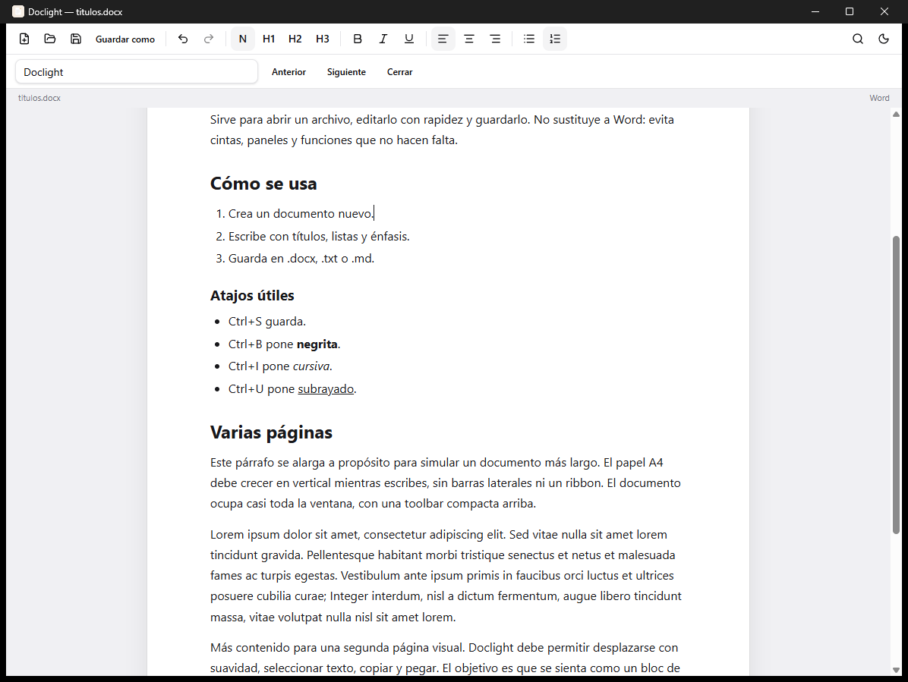

# Doclight

A lightweight, minimal local document editor for Windows.

Open a document, read it, edit text with basic formatting, copy and paste, and save it. No accounts, no cloud, no ribbon. It is not meant to replace Microsoft Word.



> The app interface is currently in Spanish.

## Features

- Opens and saves `.docx`, `.txt` and `.md`
- Headings (H1–H3), bold, italic, underline, lists, alignment and links
- Clean pasting from web pages and chat assistants
- Find in document
- Light and dark themes
- Zoom
- Registers itself under **Open with** for `.docx`, `.txt` and `.md`, and can be set as the default app from Windows

## Download

Grab the latest installer from the [Releases](https://github.com/sergiiopm/doclight/releases) page.

## Requirements (for building)

- Node.js 18 or later
- Rust (stable, MSVC toolchain on Windows)
- Visual Studio Build Tools with C++

## Development

```bash
npm install
npm run tauri dev
```

## Building the installer

```bash
npm run tauri build
```

The NSIS installer is written to `src-tauri/target/release/bundle/nsis/`. The executable is named **Doclight**.

## Keyboard shortcuts

| Shortcut | Action |
| --- | --- |
| `Ctrl+N` | New |
| `Ctrl+O` | Open |
| `Ctrl+S` | Save |
| `Ctrl+Shift+S` | Save as |
| `Ctrl+Z` | Undo |
| `Ctrl+Y` | Redo |
| `Ctrl+B` | Bold |
| `Ctrl+I` | Italic |
| `Ctrl+U` | Underline |
| `Ctrl+K` | Insert or edit link |
| `Ctrl+F` | Find |
| `Ctrl++` / `Ctrl+-` | Zoom in / out |
| `Ctrl+0` | Reset zoom |
| `Shift+F3` | Capitalize the first letter of the selection |

Right-clicking a selection opens **Transform text** (uppercase, lowercase, title case and sentence case). `Ctrl+click` opens a link in the browser.

## `.docx` limitations

Word compatibility is intentionally basic:

- Paragraphs, H1–H3, bold, italic, underline, lists, alignment and links are preserved.
- Images, tables, headers, footers, comments, complex styles, columns and tracked changes are not imported or exported.
- Re-saving a `.docx` created in Word simplifies it to the subset Doclight understands.
- Underline works fine inside Doclight, but may be lost when exporting to `.docx` in some cases (mostly inside lists). Bold, italic, headings, lists and links are kept.

## Architecture

- `src/editor` — Tiptap / ProseMirror editor
- `src/files` — opening, saving and converting formats
- `src/components` — user interface
- `src-tauri` — native window, file associations and local file I/O

## License

[MIT](LICENSE) © sergiiopm
